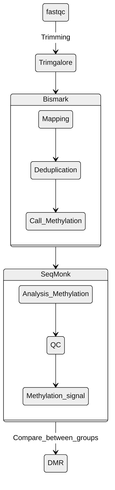

# WCS_BSseq_codes
This repository is for analyzing Whole Genome Bisulfite Sequencing in White-crowed sparrow
Author: Z.WU
Date:2023.Jan

## Pipeline

```mermaid
%%{init: {'theme':'neutral'}}%%
stateDiagram-v2
    fastqc --> Trimgalore : Trimming
    Trimgalore --> Bismark
    state Bismark{
    Mapping --> Deduplication
    Deduplication --> Call_Methylation
    }
    Bismark --> SeqMonk
    state SeqMonk {
    Analysis_Methylation --> QC
    QC --> Methylation_signal
    }
    SeqMonk --> DMR :Compare_between_groups
```
